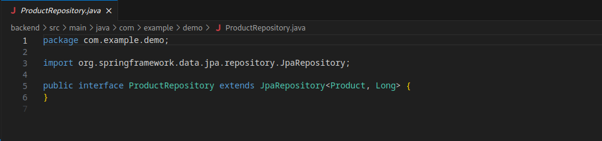

# TP Docker - Containerisation d'une Application React.js, Spring Boot et MySQL

## Prérequis
Assurez-vous d'avoir les outils suivants installés sur votre machine :
- Docker
- Docker Compose

## Étapes

### 1. Structure du Projet
Organisez votre projet de la manière suivante :
/your_project_root
|-- backend
|   |-- Dockerfile
|   |-- src
|   |-- target
|-- frontend
|   |-- Dockerfile
|   |-- public
|   |-- src
|   |-- package.json
|-- docker-compose.yml
|-- README.md

### 2. Dockerfile pour le Frontend (React.js)
Créez un fichier Dockerfile dans le dossier frontend :
```Dockerfile
FROM node:14 AS build
WORKDIR /app
COPY package*.json ./
RUN npm install
COPY . .
RUN npm run build

FROM nginx:alpine
COPY --from=build /app/build /usr/share/nginx/html
EXPOSE 80
CMD ["nginx", "-g", "daemon off;"]
```
### 3. Configuration de Docker Compose
Créez un fichier docker-compose.yml à la racine du projet :
```
version: "3"
services:
  springboot-app:
    image: springboot-app
    build: ./backend
    ports:
      - 8080:8080
    environment:
      MYSQL_HOST: mysqldb
      MYSQL_USER: root
      MYSQL_PASSWORD: root
      MYSQL_PORT: 3306

  mysqldb:
    image: mysql
    ports:
      - 3307:3306
    environment:
      MYSQL_DATABASE: test
      MYSQL_ROOT_PASSWORD: root

  react-frontend:
    image: frontend
    build: ./frontend
    ports:
      - 3000:80
```
## 4. Pull de l'Image Docker MySQL


## 5. Verification 


## 6. Création de l'Image Docker Backend (Spring Boot)

### 6.1. Backend - Entité Produit

- Créez la classe d'entité `Product` avec les propriétés nécessaires.
  


### 6.2. Backend - Contrôleur Produit

- Implémentez le contrôleur `ProductController` pour gérer les opérations CRUD des produits.
  


### 6.3. Backend - Repositories Produit

- Créez le repository `ProductRepository` pour interagir avec la base de données.
  


### 6.4. Backend - Application Produit

- Configurez l'application principale pour le backend (`ProductApplication`).
  


## 7. Création de l'Image Docker Frontend (JavaScript)

### 7.1. Frontend - Fichiers JS

- Créez les fichiers `app.js` et `index.js` pour le frontend.
  


## 8. Tester l'Application

### 8.1. Ajout des Produits

- Utilisez l'interface frontend pour ajouter des produits en appelant l'API backend correspondante.


### 8.2. Liste de Produits

- Vérifiez la liste des produits via l'interface frontend.
  


## 9. Vérification dans MySQL

### 9.1. Exécution de l'Image MySQL et Vérification de la Création

- Lancez une instance MySQL à l'aide de l'image Docker que vous avez précédemment tirée et Vérifiez dans MySQL que les données ont été correctement créées en utilisant l'application backend.
  


